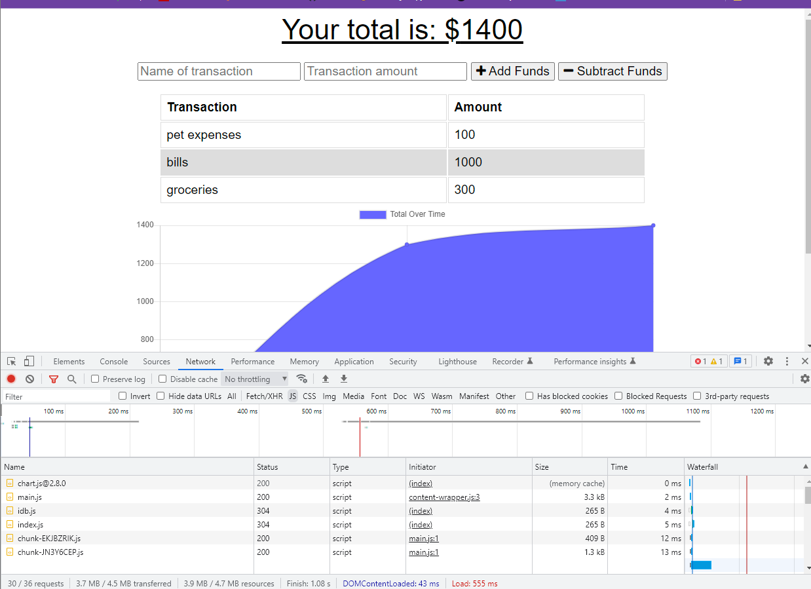
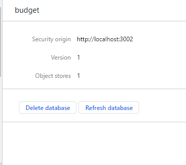
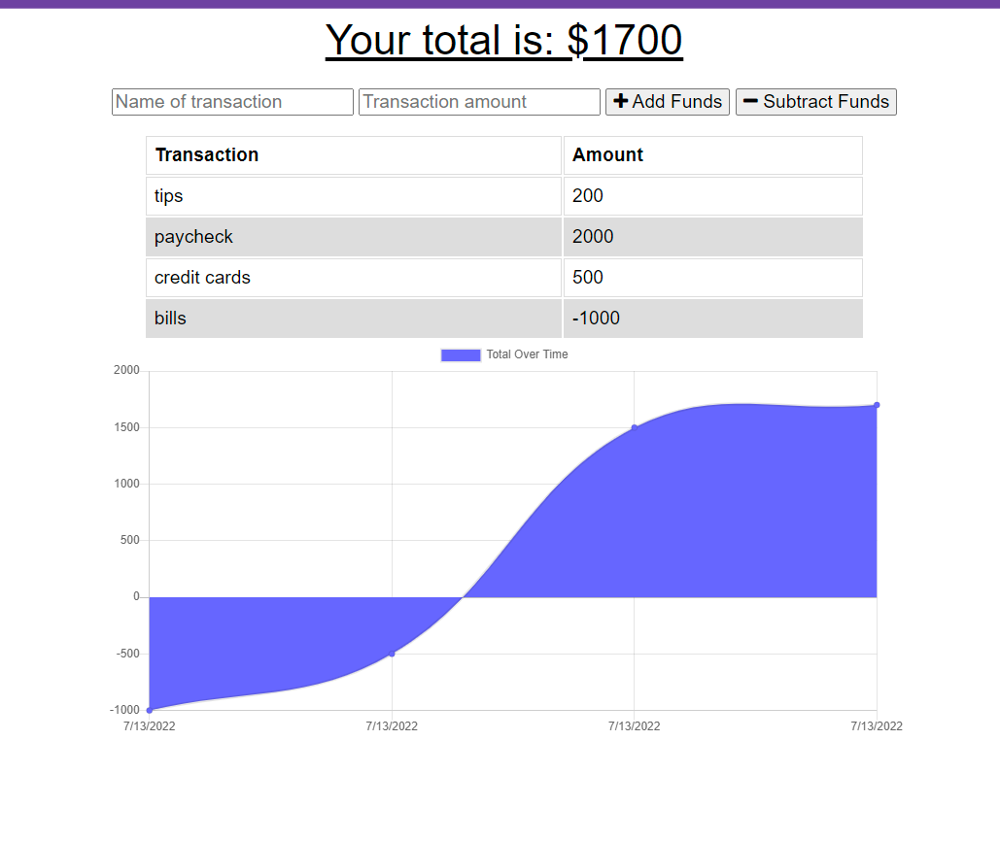
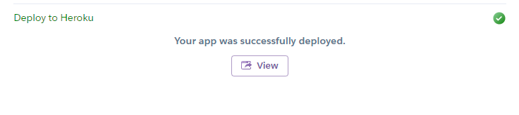

# budget-tracker
OSU Coding Bootcamp Challenge 19

    Developed using: node.js, Chrome Dev-Tools, MongoDB, Git, GitBash, Github, Heroku

------------------------------------------------------------

## Description
    GIVEN a budget tracker without an internet connection
    WHEN the user inputs an expense or deposit
    THEN they will receive a notification that they have added an expense or deposit
    WHEN the user reestablishes an internet connection
    THEN the deposits or expenses added while they were offline are added to their transaction history and their totals are updated

-------------------------------------------------------------

## Screenshots

Deployed Successfully To Heroku

-------------------------------------------------------------

## Links
[GitHub Repository](https://github.com/meganbeek98/budget-tracker.git)

[GitHub Pages Deployment](https://meganbeek98.github.io/budget-tracker/)

[Heroku Deployment](https://meganbeek98-budget-tracker.herokuapp.com/)

------------------------------------------------------------

### Developed By: Megan Beekman (2022)
